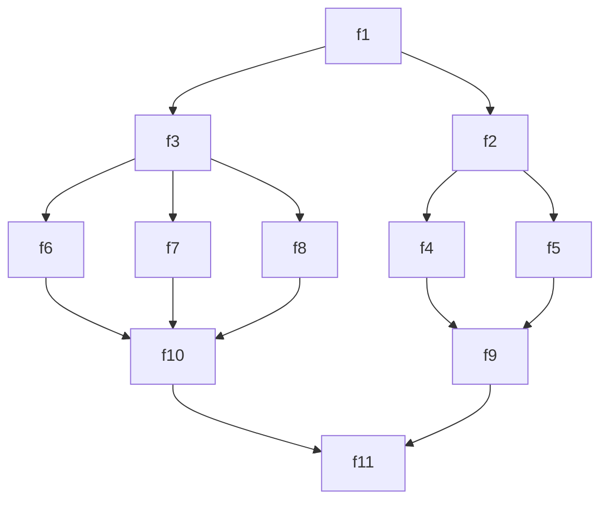

# 🎨 Code-based Visual Program Design

<div align="center">

**Engine for visual design of parallel and asynchronous programs through code**

*"Look → Understand"*

---

[](https://opensource.org/licenses/MIT)
[](https://developer.mozilla.org/en-US/docs/Web/JavaScript)
[](https://nodejs.org/)
[](https://mermaid.js.org/)

</div>

---

## 🌟 Overview

Simple approach to designing parallel asynchronous systems through **visual representation** of program execution logic.

Perfect for developers who start with **designing** the program.

## 🚀 Quick Start

To get a visual execution diagram:



### Create a Network Project

Just create and modify a JavaScript object in `dharma.js`:

```js
const dharma = {
  'f1': {
    'f2': {
      'f4': { 'f9': { 'f11': {} } },
      'f5': { 'f9': { 'f11': {} } },
    },
    'f3': {
      'f6': { 'f10': { 'f11': {} } },
      'f7': { 'f10': { 'f11': {} } },
      'f8': { 'f10': { 'f11': {} } },
    },
  },
}
```

---

## 🔧 Development Process

### Step 1: 📋 Define Structure
```bash
# Create dharma.js with dependency graph
```

### Step 2: 🔍 Generate Diagram
```bash
# Automatically create diagram
node src/dharma_2_Mermaid.js
```

### Step 3: ⚙️ Create Functions
```bash
# Automatically generate function templates
node src/aKarma_Make.js
```

### Step 4: 💻 Implement Logic
```bash
# Implement functions in karma.js
```

### Step 5: ▶️ Run Program
```bash
# Start parallel execution
node src/agami.js
```

---

## 🎯 Key Features

### 📊 Visualization
- 🖼️ **Automatic generation** of Mermaid diagrams
- 🔄 **Dynamic updates** when code changes
- 📐 **DAG support** (Directed Acyclic Graphs)

### ⚡ Performance
- 🚀 **Parallel execution** of independent nodes
- 🎯 **Automatic dependency management**
- 📈 **Real-time performance monitoring**

### 🛠️ Development
- 🔧 **Automatic generation** of function templates
- 🎨 **Colorful logging** with execution states
- 🧪 **Built-in tests** and validation

---

## 🏗️ System Architecture

### 🎭 Component Names

| Component | Meaning | Description |
|-----------|---------|-------------|
| **🌀 dharma** | Law, duty | Define structure and dependencies |
| **⚡ karma** | Action | Implement node functions |
| **🐦 agami** | Bird | Start execution movement |
| **🛞 sansara** | Cycle | Execution engine |
| **🧘 buddha** | Enlightened | Program completion handler |

---

## 📚 Theoretical Foundation

#### 🏛️ **Kuznetsov Pobisk Georgievich**
The greatest advantage of network models is the ability to represent **any kind of specific human activity in any subject area** with two elements:

1. ✏️ **Work**
2. 🎯 **State**

> **Kuznetsov P.G.** Science of Life Development: collected works. Volume III. Correct application of law / P.G. Kuznetsov. — Moscow: Russian Cosmic Society, 2015. — 560 p.: ill.

#### 🗺️ **Parondzhanov Vladimir Daniilovich**
**D**racon **L**anguage (friendly Russian algorithmic language providing clarity and reliability)

🔗 [Official DRAKON site](https://drakon.su/)

#### 🔧 **Shalyto Anatoly Abramovich**
> *"When a client asks to make a program, he usually describes the desired behavior in words. The programmer usually cannot show how the program will behave."*

**Sources:**
- 📄 [Program as engineering project](https://news.itmo.ru/ru/science/it/news/6472/)
- 📄 [Automata programming](http://is.ifmo.ru/download/2008-03-17_automata.pdf)
- 🌐 [AUTOMATIC PROGRAMMING SITE](https://is.ifmo.ru/)

---

## 🎨 Output Colors

```
🟢 Green   : Completed tasks
🔴 Red     : Errors and failures
🟡 Yellow  : In-progress operations
🔵 Blue    : System information
🟣 Purple  : Final results
```

---

## 📈 Monitoring and Debugging

### 📊 Execution Metrics
- ⏱️ **Execution time** of each node
- 📝 **State status** (init, running, complete, error)
- 🔗 **Dependencies** between nodes
- 📊 **Overall execution** statistics

### Key Idea:
Attempt to overcome the paradox:

Designing programs visually is more reliable and engaging, but most developers do not use visual tools.
Well, since they write code, let them design with code too :-).
And yes — version control — after all, we are working with text.

How nice it is to open someone else's project or your old one — and there are diagrams!  
And they are linked to the code!  
No need to pretend to be a computer, grinding through code and complexity to understand what's going on here!  

🤗 Goodbye legacy code![1][2]


### TODO:  
- Set up Mermaid and Karma.js generation to run on changes to dharma.js  
- Transpile for other programming languages
