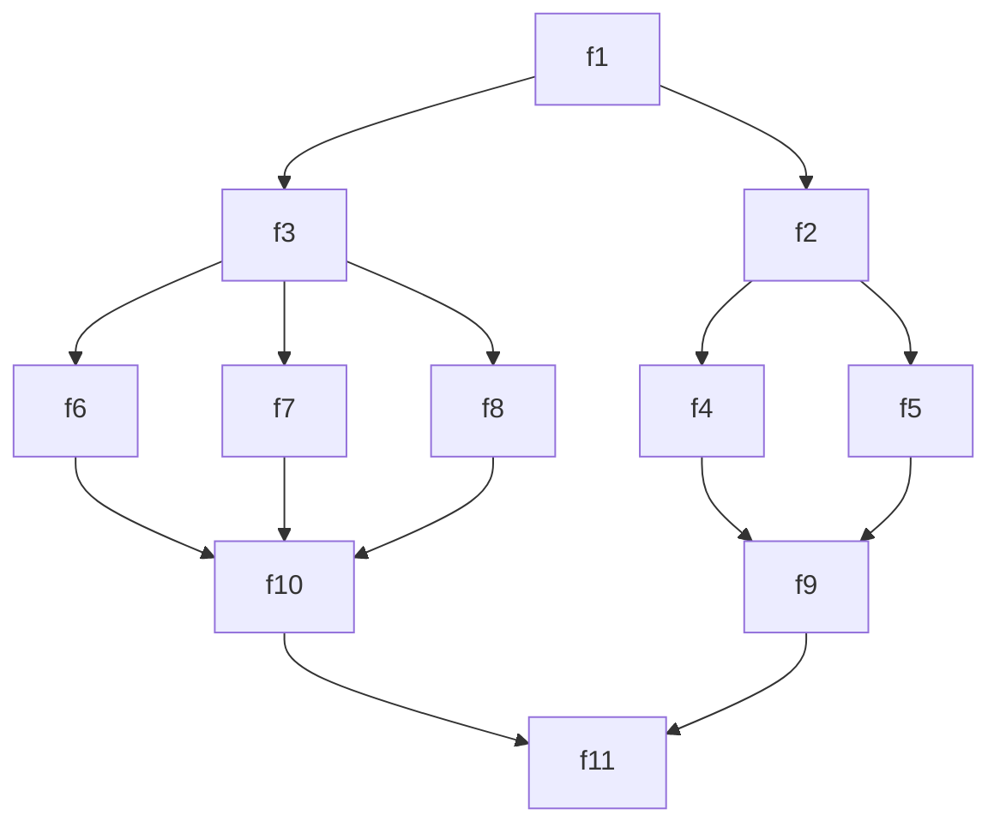

# Code-based Visual Program Design

Библиотека для визуального проектирования параллельных и асинхронных программ кодом.

Чтобы получить сетевой проект параллельной программы вида


Достаточно создать объект js
```js
const dharma_4 = {
  'f1': {
    'f2': {
      'f4': { 'f9': { 'f11': {} } },
      'f5': { 'f9': { 'f11': {} } },
    },
    'f3': {
      'f6': { 'f10': { 'f11': {} } },
      'f7': { 'f10': { 'f11': {} } },
      'f8': { 'f10': { 'f11': {} } },
    },
  },
};
```

И спокойно создаёте функции.
Функция должна возвращать тип монада:
```js
return { state: '', info: 'данные f6' };
```

Порядок создания проекта:
1 - в файле dharma.js создаёт датафлоу - сетевой график управления.
2 - в файле karma.js реализуйте фукнции
3 - 


## Лицензия

MIT