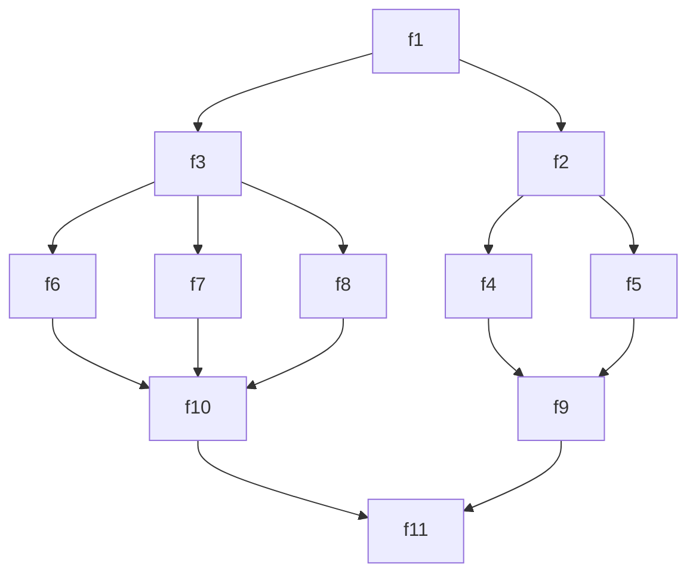

# 🎨 Code-based Visual Program Design

<div align="center">

**Движок для визуального проектирования параллельных и асинхронных программ кодом**

*"Взглянул → Понял"*

---

[](https://opensource.org/licenses/MIT)
[](https://developer.mozilla.org/en-US/docs/Web/JavaScript)
[](https://nodejs.org/)
[](https://mermaid.js.org/)

</div>

---

## 🌟 Концепция

Простой подход к проектированию параллельных асинхронных систем через **наглядное представление** логики выполнения программы.

Зайдёт тому, кто сначала **проектирует** программу.

## 🚀 Быстрый старт

Чтобы получить наглядную диаграмму выполнения:



### Создайте сетевой проект

Всего лишь создайте и изменяйте JavaScript объект в файле `dharma.js`:

```js
const dharma = {
  'f1': {
    'f2': {
      'f4': { 'f9': { 'f11': {} } },
      'f5': { 'f9': { 'f11': {} } },
    },
    'f3': {
      'f6': { 'f10': { 'f11': {} } },
      'f7': { 'f10': { 'f11': {} } },
      'f8': { 'f10': { 'f11': {} } },
    },
  },
}
```

---

## 🔧 Процесс разработки

### Шаг 1: 📋 Определение структуры
```bash
# Создайте dharma.js с графом зависимостей
```

### Шаг 2: 🔍 Генерация диаграммы
```bash
# Запустите автоматическое создание схемы
node src/dharma_2_Mermaid.js
```

### Шаг 3: ⚙️ Создание функций
```bash
# Автоматически сгенерируйте заготовки функций
node src/aKarma_Make.js
```

### Шаг 4: 💻 Реализация логики
```bash
# Реализуйте функции в файле karma.js
```

### Шаг 5: ▶️ Запуск программы
```bash
# Запустите параллельное выполнение
node src/agami.js
```

---

## 🎯 Основные возможности

### 📊 Визуализация
- 🖼️ **Автоматическая генерация** диаграмм Mermaid
- 🔄 **Динамическое обновление** схемы при изменении кода
- 📐 **Поддержка DAG** (направленных ациклических графов)

### ⚡ Производительность
- 🚀 **Параллельное выполнение** независимых узлов
- 🎯 **Автоматическое управление** зависимостями
- 📈 **Мониторинг производительности** в реальном времени

### 🛠️ Разработка
- 🔧 **Автоматическая генерация** заготовок функций
- 🎨 **Цветное логирование** с состояниями выполнения
- 🧪 **Встроенные тесты** и валидация

---

## 🏗️ Архитектура системы

### 🎭 Имена компонентов

| Компонент | Значение | Описание |
|-----------|----------|----------|
| **🌀 dharma** | Закон, долг | Определение структуры и зависимостей |
| **⚡ karma** | Действие | Реализация функций-узлов |
| **🐦 agami** | Птица | Инициация движения |
| **🛞 sansara** | Вращение | Движок выполнения |
| **🧘 buddha** | Просветленный | Обработчик завершения программы |

---

## 📚 Теоретические основы

#### 🏛️ **Кузнецов Побиск Георгиевич**
Величайшим достоинством сетевых моделей плана является способность представить **любые виды конкретной человеческой деятельности в любой предметной области** двумя элементами:

1. ✏️ **Работой** (процесс)
2. 🎯 **Событием** (результат)

> **Кузнецов П.Г.** Наука развития Жизни: сборник трудов. Том III. Правильное применение закона / П.Г. Кузнецов. — М.: Русское Космическое Общество, 2015. — 560 с.: ил.

#### 🗺️ **Паронджанов Владимир Даниэлович**
**Д**ружелюбный **Р**усский **А**лгоритмический язык, **К**оторый **О**беспечивает **Н**аглядность/**Н**адёжность

🔗 [Официальный сайт ДРАКОН](https://drakon.su/)

#### 🔧 **Шалыто Анатолий Абрамович**
> *"Когда заказчик просит сделать ему программу, то он, обычно, описывает желаемое поведение словами. 
> 
> Программист, обычно, не может показать, как будет вести себя программа."*
- 📄 [Программа как инженерный проект](https://news.itmo.ru/ru/science/it/news/6472/)
- 📄 [Автоматное программирование](http://is.ifmo.ru/download/2008-03-17_automata.pdf)
- 🌐 [САЙТ ПО АВТОМАТНОМУ ПРОГРАММИРОВАНИЮ](https://is.ifmo.ru/)


## Ключевая идея: 

Попытка преодолеть парадокс:

Проектировать программы визуально надёжнее и интереснее, но большинство разработчиков не используют визуальные инструменты.
Нуштош, раз они пишут кодом, пусть и проектируют кодом :-).
И да - контроль версий - мы же в тексте.

Как приятно открыть чужой проект или старый свой - а там схемы! 
И они связаны с кодом!
Не нужно изображать из себя компьютер, перемелываю код и сложность, чтобы понять - что тут происходит!


🤗 Прощай легаси-код!

### TODO:
- настроить запуск генерации mermaid и karma.js при изменении dharma.js
- транспилировать для других языков программирования.
